# Klyukin
___
## Задание 2.3.2 Тестирование
___
__Отчёт о тестировании__:

* 1 вариант функции преобразования даты публикации и время работы: 
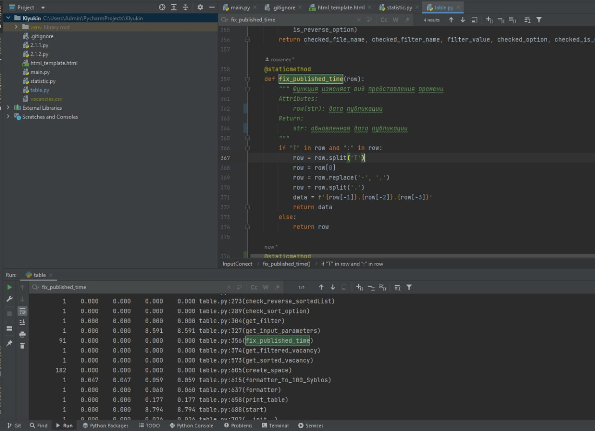
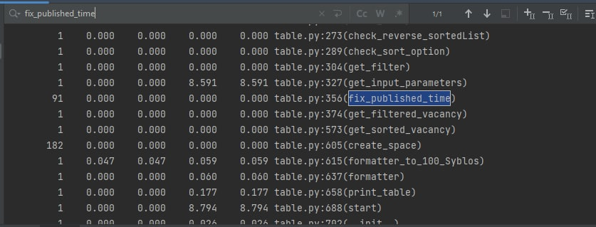
* 2 вариант функции преобразования даты публикации и время работы: 
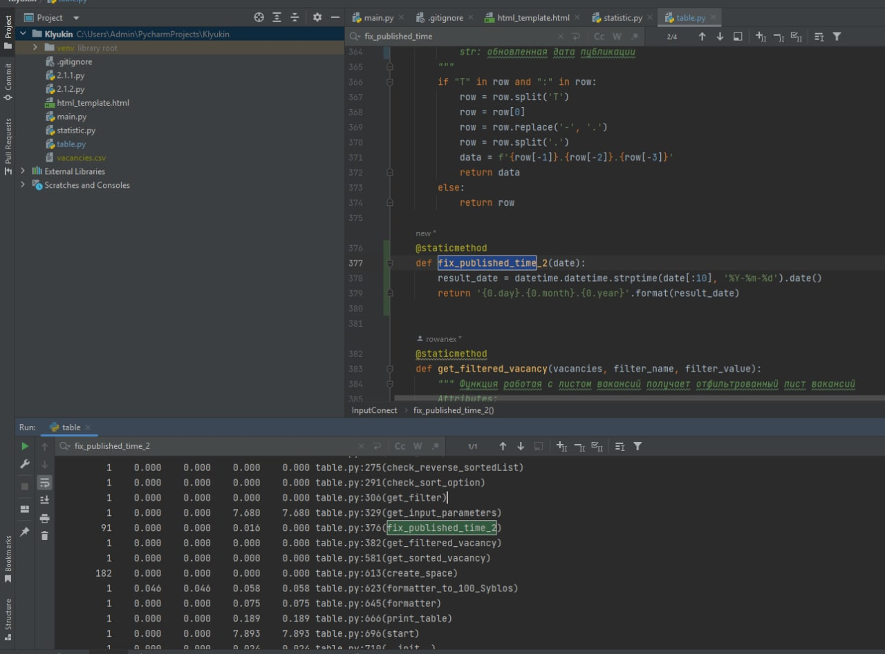
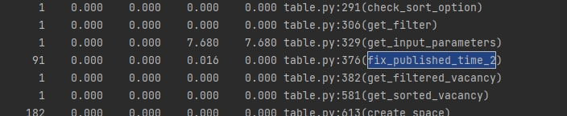
* 3 вариант функции преобразования даты публикации и время работы: 
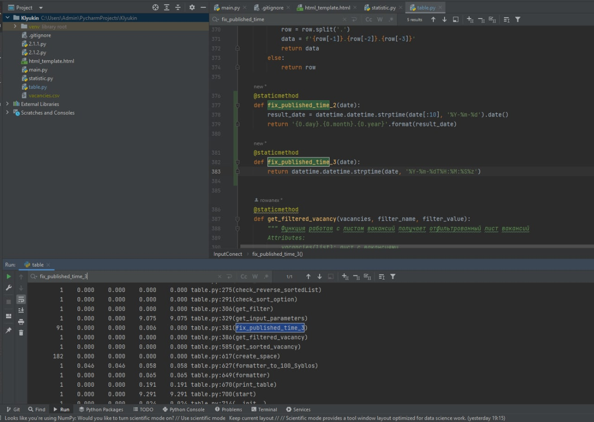
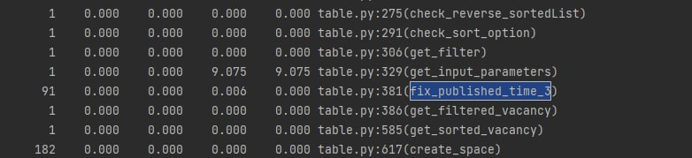
___
По итогам профилирования и оценки решил оставить 1 реализацию решения задачи по изменению формата даты
___
## Задание 3.2.1 Разделить данные
___
Csv файлы, созданные разделением одного csv файла 
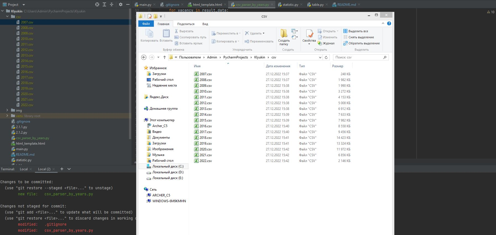
___
## Задание 3.2.2 Многопроцессорная обработка
___
Получение статистики по годам без мултипроцессорной обработки
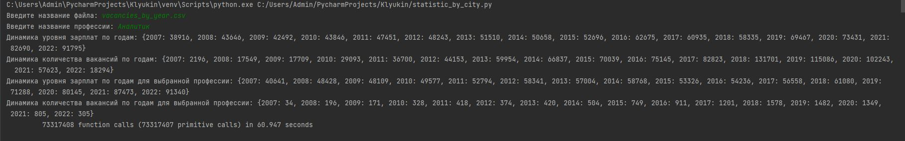
___
Получение статистики по годам с мультипроцессорной обработкой
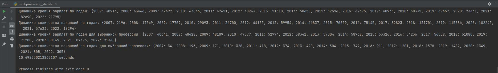
___
Решил оставить мультипроцессорную обработку данных

## Задание 3.2.3 Concurrent futures
___
Получение статистики по годам с мультипроцессорной обработкой

___
Получение статистики по годам с многопроцессорной обработкой
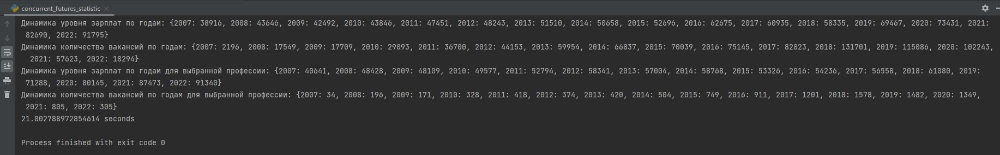
___
Решил оставить мультипроцессорную обработку данных, так как она работает эффективнее
## Задание 3.3.1 Курсы валют
___
Новые файлы по годам основанные на vacancies_dif_currencies.csv
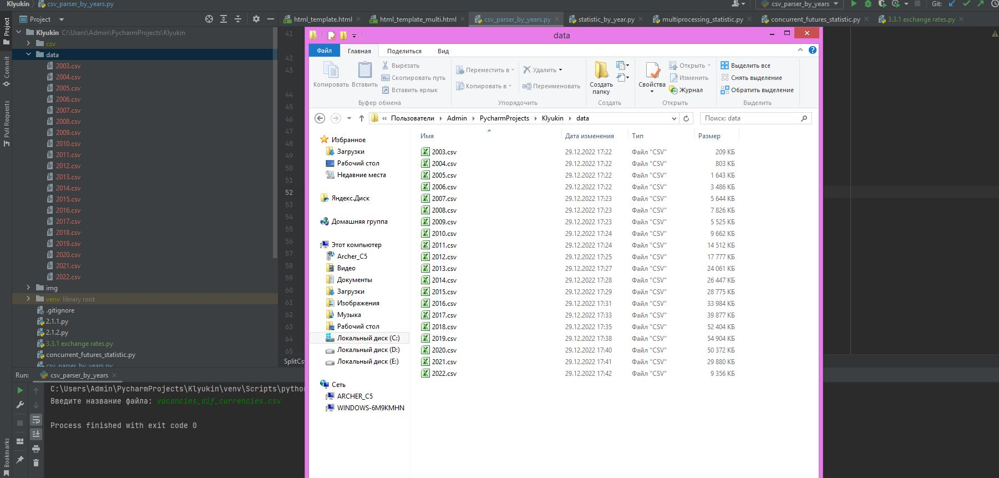
___
Частотность валют

___
Скриншот датафрейма
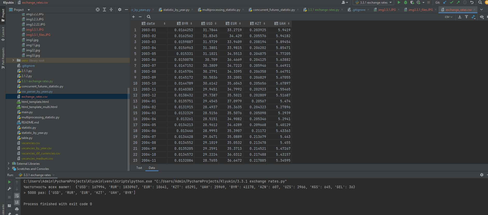